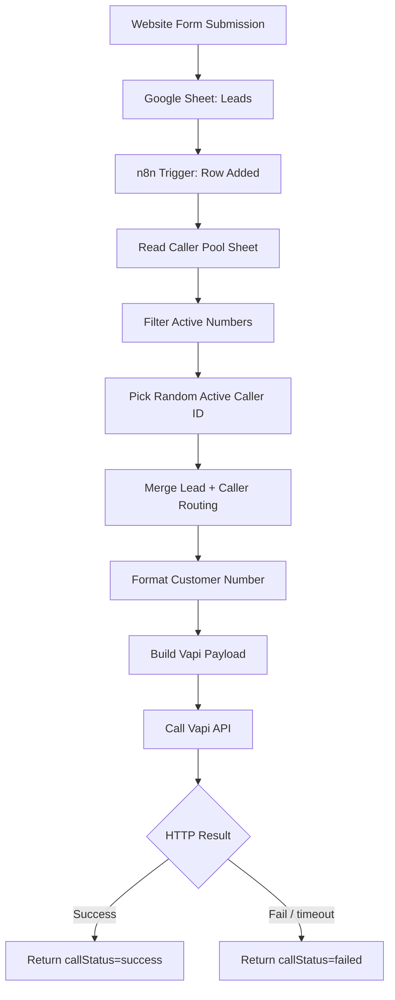
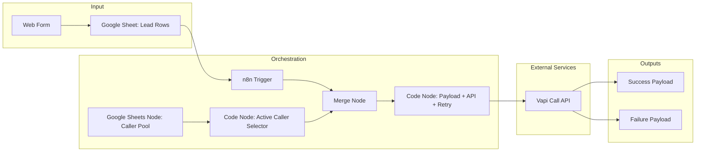

# AI Calling Automation & Lead Response System

[](https://n8n.io/)
[](https://vapi.ai/)
[](https://sheets.google.com/)
[](https://github.com/)
[](LICENSE)

> **Automated Speed-to-Lead Calling Pipeline with Global Number Formatting, Smart Routing, and Retry-Safe API Execution**

Turn incoming form submissions into near-instant AI outbound calls using a fully automated n8n workflow.

---

## 📋 Table of Contents

- [What is This Project?](#-what-is-this-project)
- [Why This Matters](#-why-this-matters)
- [How It Works](#-how-it-works)
- [Market Need & Business Value](#-market-need--business-value)
- [Industrial Applications](#-industrial-applications)
- [System Architecture](#-system-architecture)
- [Scenario Coverage](#-scenario-coverage)
- [Features & Capabilities](#-features--capabilities)
- [Setup & Installation](#-setup--installation)
- [Data Contract](#-data-contract)
- [ROI Calculator](#-roi-calculator)
- [Future Enhancements](#-future-enhancements)
- [Contributing](#-contributing)
- [Contact](#-contact)

---

## 🎯 What is This Project?

This is an **event-driven lead response automation system** built in n8n.

It monitors Google Sheets for newly submitted leads, enriches each lead with an active outbound caller ID, formats the customer phone number into global format, and triggers an AI voice call through Vapi.

### 🔑 Core Components

1. **Lead Trigger Layer**
   - Detects new lead rows from Google Sheets.

2. **Routing Layer**
   - Pulls caller IDs from a phone pool sheet.
   - Selects one active number dynamically.

3. **Call Execution Layer**
   - Builds outbound payload.
   - Calls Vapi API with retry and timeout policy.

4. **Result Layer**
   - Returns structured status for success/failure monitoring.

### 🎨 What Makes It Special

✅ **Speed-to-Lead Automation**: Near real-time first contact  
✅ **Global Number Handling**: E.164-style formatting logic  
✅ **Smart Caller Routing**: Active phone pool + random distribution  
✅ **Retry-Safe API Design**: Exponential backoff for `429`  
✅ **Operationally Reliable**: Explicit fail states and traceable output

---

## 💡 Why This Matters

### The Lead Conversion Problem

Most sales teams underperform because hot leads are contacted too late.

- Manual follow-up introduces delays
- First response is inconsistent across teams
- Lead quality decays rapidly with time
- APIs can fail under throttling without retries

### Typical business impact of delayed outreach

| Metric | Typical Range | Business Effect |
|--------|---------------|-----------------|
| First response delay | 5–60 minutes | Lower conversion intent |
| Missed call attempts | 10–25% | Lost opportunities |
| Manual follow-up workload | 10–20 hrs/week | SDR productivity drop |
| API transient failures (peak load) | 2–8% | Inconsistent lead handling |

### Problems This Project Solves

✅ Automated first contact from form submission  
✅ Consistent outreach workflow across all leads  
✅ Better call success via normalized phone input  
✅ Lower failure rate with retry-on-throttle strategy  
✅ Structured response logs for operations and debugging

---

## 🔧 How It Works

### End-to-End Data Flow



### Workflow Logic Pipeline

```text
New Lead → Caller Pool Lookup → Active ID Selection → Merge Data
→ Number Formatting → API Call → Retry if 429 → Final Output
```

### Retry Policy

For rate-limited responses (`429`), the delay follows:

$$
	ext{delay(ms)} = 1500 \times 2^{(attempt-1)}
$$

Max attempts: `5`

---

## 💼 Market Need & Business Value

### Target Users

1. **Agencies with inbound form traffic**
2. **SMB sales teams needing fast callback workflows**
3. **Call centers with dynamic outbound routing**
4. **Automation consultants delivering lead pipelines**

### Revenue/Value Models

| Model | Description | Typical Pricing |
|-------|-------------|-----------------|
| Workflow implementation | One-time setup for sales teams | $500–$5,000 |
| Managed automation | Ongoing monitoring + optimization | $200–$2,000/month |
| White-label automation | Agency resale package | Custom |
| Integration extension | CRM + analytics enhancements | $1,000+ per integration |

### Competitive Advantages

✅ Faster than manual callback loops  
✅ Low-complexity stack (n8n + Sheets + Vapi)  
✅ Easy to scale with additional routing logic  
✅ Resilient API pattern for production usage

---

## 🏭 Industrial Applications

### 1. Real Estate Lead Follow-up
- Trigger AI calls from listing inquiry forms
- Route calls by campaign/source
- Track response quality per lead type

### 2. Healthcare Appointment Pre-Calls
- Auto-call new inquiry submissions
- Capture appointment intent quickly
- Reduce patient drop-off before booking

### 3. Education Admissions Outreach
- Instant callback for prospect students
- Program-specific call scripts
- Regional caller ID mapping

### 4. E-commerce High-Intent Leads
- Call cart recovery/high-value form leads
- Fast qualification before handoff to sales

### 5. B2B Service Qualification
- Outbound qualification call after website form
- Prioritize enterprise intent via metadata fields

---

## 🏗️ System Architecture

### High-Level Architecture



### Technical Stack

```text
Automation Engine:
├─ n8n Workflow Automation
├─ Google Sheets Trigger + Read Nodes
├─ Merge + JavaScript Code Nodes
└─ Built-in HTTP helper with timeout and retries

Integrations:
├─ Google Sheets API (Lead + Caller pool)
└─ Vapi REST API (Outbound AI calls)

Logic Highlights:
├─ Dynamic header normalization (status/id)
├─ Active row filtering
├─ Randomized caller routing
├─ Global number formatter
└─ Exponential backoff on API throttling
```

---

## 🧪 Scenario Coverage

### Scenario 1 — Happy Path
- New lead arrives with valid phone number
- Active caller ID available
- API responds successfully
- Output: `callStatus=success`

### Scenario 2 — API Rate Limit (`429`)
- First request throttled
- Workflow retries with exponential delays
- Call succeeds in subsequent attempt

### Scenario 3 — No Active Caller IDs
- Caller pool has zero `active` records
- Workflow fails early with explicit error
- Prevents invalid outbound call attempts

### Scenario 4 — Invalid/Mixed Phone Format
- Local or malformed number submitted
- Formatter converts to global style where possible
- Reduces rejection probability at provider layer

### Scenario 5 — Hard Failure or Timeout
- Non-retryable API error or retries exhausted
- Output: `callStatus=failed` + error message

---

## ✨ Features & Capabilities

### Core Features

✅ Google Sheets event trigger (new lead row)  
✅ Dynamic active caller ID selection  
✅ Lead + routing data merge pipeline  
✅ Global number normalization helper  
✅ API timeout and retry-on-429  
✅ Structured success/failure output

### Advanced Capabilities

🚀 **Header-tolerant data parsing**
```javascript
const norm = s => String(s).toLowerCase().replace(/\s+/g,'');
```

🚀 **Active caller fail-fast logic**
```javascript
if (!active.length) throw new Error('No ACTIVE rows in Phone Numbers');
```

🚀 **Resilience-first call design**
```javascript
if (status === 429 && attempt < maxRetries) {
  await new Promise(r => setTimeout(r, baseWaitTime * Math.pow(2, attempt - 1)));
}
```

---

## 🚀 Setup & Installation

### Prerequisites

```bash
✅ n8n instance (Cloud or Self-hosted)
✅ Google account with Sheets access
✅ Vapi account (assistant + phone number)
✅ Two Google Sheets tabs:
   - Lead submissions
   - Outbound caller pool
```

### Step-by-Step Setup

1. Import workflow JSON into n8n.
2. Connect Google Sheets credentials.
3. Configure Vapi credentials/token securely.
4. Set spreadsheet IDs and sheet names.
5. Verify caller pool has status + ID fields.
6. Activate workflow.
7. Add a test lead row and validate execution.

### Production Hardening Checklist

- Move secrets to n8n credentials/env vars
- Rotate any exposed token before deployment
- Add alerting for repeated failures
- Add logging sink for auditability

---

## 📦 Data Contract

### Expected input fields

- `Name`
- `Email`
- `Phone Number`
- `Form Name`
- `Page URL`
- `You are interested in`
- `When You Want To Start?`
- `Website URL`
- `Business Name`

### Output fields

- `callStatus` (`success` or `failed`)
- `calledNumber`
- `vapiResponse` (when success)
- `error` (when failed)
- Original lead data

---

## 💰 ROI Calculator

### Simple model

```javascript
const model = {
  leadsPerMonth: 800,
  manualFirstResponseMin: 20,
  automatedFirstResponseMin: 1,
  sdrHourlyRate: 25,
  manualOpsHoursPerMonth: 40,
  automationOpsHoursPerMonth: 8,
  conversionLiftPercent: 8,

  estimate() {
    const savedOpsHours = this.manualOpsHoursPerMonth - this.automationOpsHoursPerMonth;
    const laborSavings = savedOpsHours * this.sdrHourlyRate;
    return {
      savedOpsHoursPerMonth: savedOpsHours,
      monthlyLaborSavingsUSD: laborSavings,
      speedToLeadImprovement: `${this.manualFirstResponseMin}m → ${this.automatedFirstResponseMin}m`,
      expectedConversionLift: `${this.conversionLiftPercent}%`
    };
  }
};

console.log(model.estimate());
```

---

## 🔮 Future Enhancements

### Short-Term

1. Write call outcomes back to Sheets/CRM
2. Add Slack/Email notifications on failure
3. Add timezone-aware calling window rules

### Medium-Term

4. Add duplicate lead prevention
5. Add campaign-level routing rules
6. Add call attempt dashboard and retry analytics

### Long-Term

7. AI-based lead prioritization before calling
8. Multi-language script selection by region
9. Predictive callback optimization by time slot

---

## 🤝 Contributing

Contributions are welcome.

1. Fork repository
2. Create feature branch
3. Test changes with sample lead data
4. Submit PR with clear before/after behavior

---

## 📄 License

This project is licensed under the **MIT License**.

---

## 📧 Contact

- **GitHub**: [@abdullahsajid-dev](https://github.com/abdullahsajid-dev)
- **LinkedIn**: [Abdullah Sajid](https://www.linkedin.com/in/abdullahsajiddev/)
- **Email**: abdullahsajid.dev@gmail.com

---

## 📊 Project Stats


---

<div align="center">

### ⭐ If this project helped you, consider starring the repository.

**Automating Speed-to-Lead with Reliable AI Calling Workflows**

</div>

---

**Last Updated**: March 14, 2026  
**Version**: 1.0.0  
**Status**: ✅ Portfolio Ready
